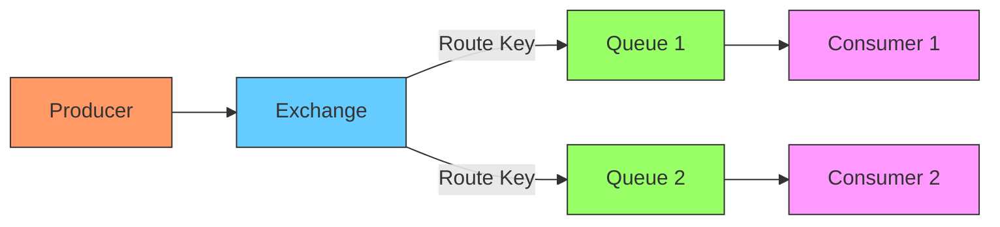
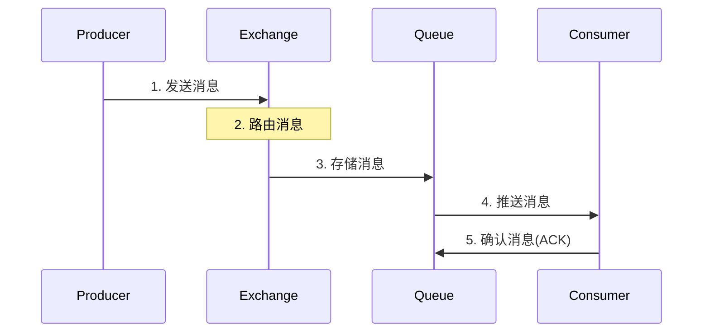
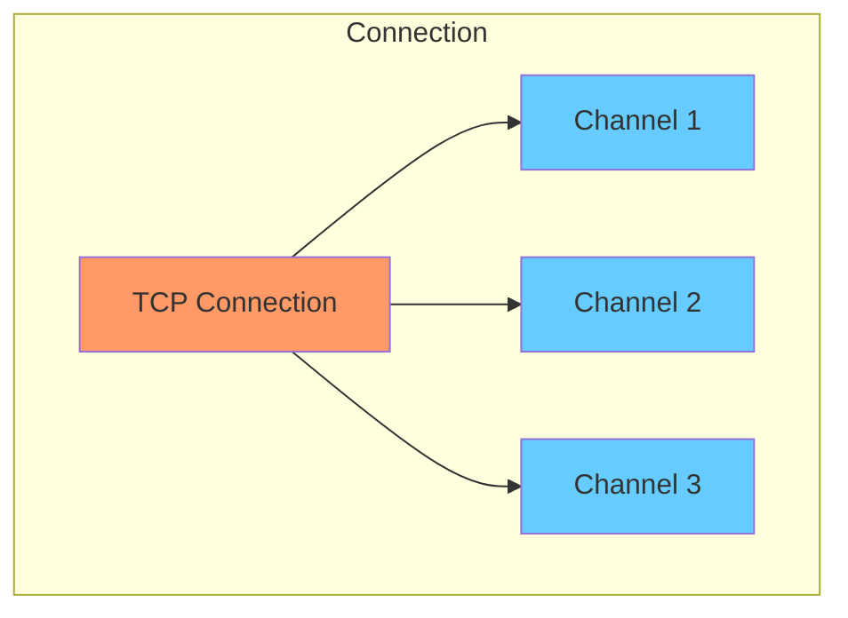
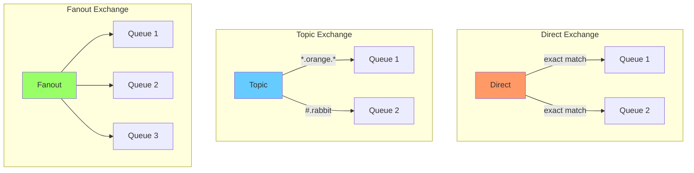

## 核心组件

**Broker（消息中间件）**

- RabbitMQ Server，负责接收和分发消息的应用

- 提供一种传输服务，维护消息的传输，将消息分发到相应队列

**Producer（生产者）**

- 投递消息的一方

- 创建消息，发布到 RabbitMQ 中

- 消息一般包含两个部分：消息体（payload）和标签（label）

**Consumer（消费者）**

- 接收消息的一方

- 连接到 RabbitMQ 服务器，订阅队列

- 消费队列中的消息

**Queue（队列）**

- 消息存储的地方

- FIFO 原则：先进先出

- 多个消费者可以订阅同一个队列，队列中的消息会被平均分摊给多个消费者

**Exchange（交换机）**

- 接收生产者发送的消息，根据路由键转发到绑定的队列

- 类型：
    - Direct：直接匹配
    - Topic：通配符匹配
    - Fanout：广播
    - Headers：根据消息属性匹配

**Binding（绑定）**

- Exchange 和 Queue 之间的虚拟连接

- 定义了 Exchange 和 Queue 之间的消息分发规则

**Channel（信道）**

- 建立在 Connection 连接之上的虚拟连接

- 复用 TCP 连接，减少性能开销

- 每个线程创建单独的 Channel，实现多线程通信

**Virtual Host（虚拟主机）**

- 权限控制的基本单位

- 每个 VHost 相当于一个独立的小型 RabbitMQ 服务器

- 拥有自己的队列、交换器和绑定关系

## 工作原理

**消息流转过程**

1. Producer 创建消息，发送到 Exchange

2. Exchange 接收到消息后，根据消息的 RoutingKey 和 Exchange 类型，查找匹配的 Queue

3. Exchange 将消息路由到一个或多个 Queue 中

4. Queue 将消息存储起来，等待 Consumer 消费

5. Consumer 监听（订阅）Queue，获取消息进行处理

**消息投递流程**

1. **生产者发送消息**
    - 创建 Connection（TCP 连接）

    - 创建 Channel（信道）

    - 声明 Exchange

    - 发送消息到 Exchange

2. **交换机路由消息**
    - 根据 Exchange 类型和绑定规则

    - 将消息路由到一个或多个队列

    - 如果没有匹配的队列，消息将被丢弃

3. **队列存储消息**
    - 按照 FIFO 原则存储消息

    - 如果队列已满，可能触发溢出策略

    - 支持消息持久化到磁盘

4. **消费者处理消息**
    - 创建 Connection 和 Channel

    - 声明要监听的队列

    - 订阅队列并处理消息

    - 发送消息确认（ACK）

**通信机制**

1. **Connection（连接）**
    - TCP 连接，长连接

    - 支持多个 Channel 复用

    - 包含认证、IP、端口等信息

2. **Channel（信道）**
    - 轻量级连接，建立在 Connection 之上

    - 每个线程一个 Channel

    - 支持并发通信

3. **心跳机制**
    - 默认心跳间隔 60 秒

    - 检测连接是否正常

    - 及时发现连接故障

**高级特性**

1. **消息分发**
    - Round-Robin（轮询）

    - Fair Dispatch（公平分发）

    - 消息优先级

2. **消息顺序性**
    - 单队列单消费者保证顺序

    - 多队列或多消费者不保证顺序

    - 消息重试可能破坏顺序

3. **流量控制**
    - Consumer 预取计数（prefetch count）

    - Publisher 流控（flow control）

    - 内存警告（memory alarm）

## 交换机类型

**Direct Exchange**

- 精确匹配路由键

- 消息会被转发到 BindingKey 和 RoutingKey 完全匹配的队列

**Topic Exchange**

- 模式匹配路由键

- 支持通配符：* (一个单词)，# (零个或多个单词)

**Fanout Exchange**

- 广播模式

- 忽略路由键，消息将发送给所有绑定的队列

**Headers Exchange**

- 根据消息属性匹配

- 性能较差，使用较少

## 可靠性机制

**消息确认**

- Producer 确认
    - Publisher Confirm：消息发送到 Exchange 的确认

    - Publisher Return：消息从 Exchange 路由到 Queue 的确认

- Consumer 确认
    - Auto ACK：自动确认

    - Manual ACK：手动确认

    - Reject：拒绝消息

**持久化**

- Exchange 持久化：声明时指定 durable=true

- Queue 持久化：声明时指定 durable=true

- Message 持久化：发送时指定 deliveryMode=2

## 应用场景

**异步处理**

- 用户注册邮件通知

- 订单处理

**应用解耦**

- 订单系统与库存系统解耦

- 支付系统与物流系统解耦

**流量削峰**

- 秒杀系统

- 日志处理

**消息通讯**

- 即时通讯

- 群聊广播

